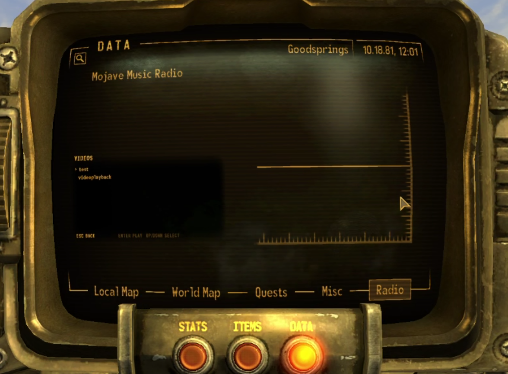
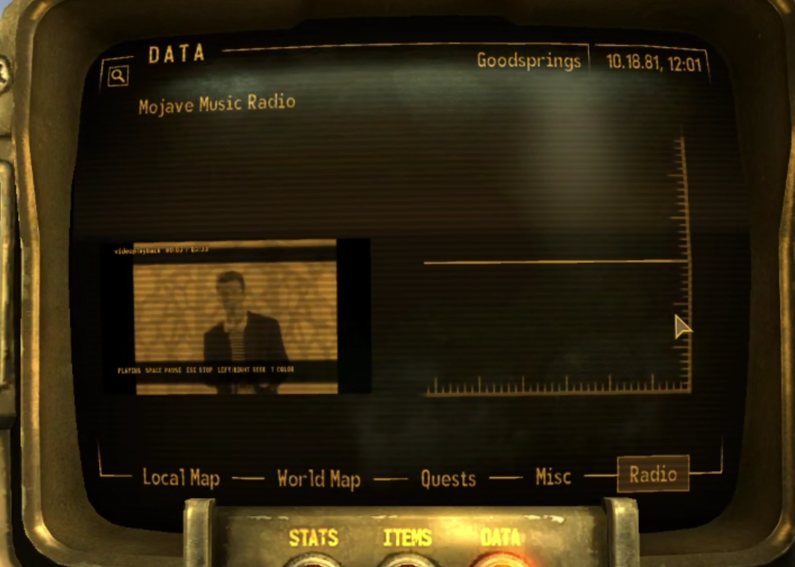
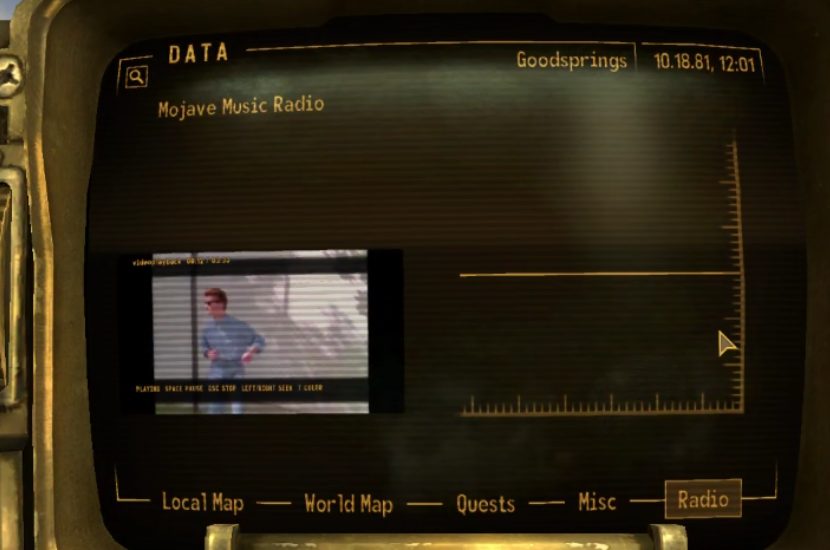

# Pip-Boy Video Player

Pip-Boy Video Player plays local MP4 files inside the Fallout: New Vegas Pip-Boy. It is a 32-bit xNVSE plugin with native video decoding, synchronized audio, mouse controls, and keyboard controls. It does not require an ESP.

The current private release candidate is `0.1.0-rc.3`.

## Screenshots

### Video catalog



### Pip-Boy tint mode



### Full-color mode



## What it supports

- FalloutNV 1.4.0.525 with xNVSE 6.4.5 or newer
- Viva New Vegas Base and Extended
- UIO 2.30
- MP4 files with H.264 video and optional AAC audio
- Sources up to 1920 by 1080
- Variable frame rate video and right-angle rotation metadata
- Mono, stereo, and multichannel AAC, with multichannel audio downmixed for playback
- Aspect Fit and Fill modes
- Full color and Pip-Boy tint modes
- Native Direct3D 9 in fullscreen and windowed mode

The complete Pip-Boy UI and playback path passed at 1920 by 1080 fullscreen. Windowed mode passed a measured 50-cycle focus-loss test and is the safer choice if you Alt+Tab often. DXVK and controller input are not supported.

## Requirements

- Windows 10 or Windows 11
- Fallout: New Vegas 1.4.0.525
- Mod Organizer 2
- xNVSE 6.4.5 or newer
- UIO 2.30
- A working Viva New Vegas Base or Extended installation

## Install with Mod Organizer 2

1. Download `PipBoyVideoPlayer-0.1.0-rc.3.zip`.
2. In Mod Organizer 2, select **Install a new mod from an archive**.
3. Choose the downloaded ZIP and name the mod `Pip-Boy Video Player`.
4. Enable the mod in the left pane.
5. Confirm that UIO is enabled in the same profile.
6. Launch Fallout: New Vegas through the xNVSE entry in Mod Organizer 2.

Do not extract the FFmpeg DLLs into the game directory or the shared `NVSE\Plugins` directory. They belong in the player's private `NVSE\Plugins\PipBoyVideoPlayer\bin` directory, which is already correct in the archive.

The [installation and video tutorial](docs/installation-and-use.md) includes the full MO2 setup, supported file details, and removal steps.

## Add videos

Keep your videos in a separate MO2 mod so an update cannot overwrite them:

1. Right-click the MO2 left pane and select **Create empty mod**.
2. Name it `Pip-Boy Videos`.
3. Open that mod in Explorer.
4. Create `NVSE\Plugins\PipBoyVideoPlayer\Videos` inside it.
5. Copy your `.mp4` files directly into the `Videos` folder.
6. Enable `Pip-Boy Videos` and restart the game through MO2.

The resulting folder is:

```text
<MO2 instance>\mods\Pip-Boy Videos\NVSE\Plugins\PipBoyVideoPlayer\Videos
```

The catalog reads files directly inside this folder. It does not scan subfolders. Filenames may use Unicode characters, and the list uses natural sorting.

## Set up the reference VNV profile

If you are working from this repository, the setup helper can prepare the reference MO2 instance. It installs the checked runtime archive and creates the personal video mod. The new profile starts from the Extended configuration without copying its saves.

Run this from the repository root while FalloutNV and Mod Organizer 2 are closed:

```powershell
.\scripts\setup-gameplay-profile.ps1 `
  -InstanceRoot '<MO2 instance>' `
  -RuntimeArchive '.\dist\PipBoyVideoPlayer-0.1.0-rc.3.zip' `
  -SelectProfile
```

The new profile is named `Pip-Boy Video Player`. The helper disables the PBVP test fixtures in that profile and selects it. It does not change an existing VNV profile. Repeat runs preserve saves, personal videos, and edited player settings.

## Use the player

1. Open the Pip-Boy and select Data.
2. Select `VIDEOS`.
3. Choose a video with the mouse or Up and Down Arrow keys.
4. Press Enter or left-click the selected video.

| Action | Input |
| --- | --- |
| Select or play | Enter or left click |
| Pause or resume | Space |
| Stop or go back | Escape, Backspace, or right click |
| Seek backward | Left Arrow |
| Seek forward | Right Arrow |
| Previous video | Up Arrow or wheel up |
| Next video | Down Arrow or wheel down |
| Toggle tint or full color | T |

Closing the Pip-Boy hides the picture, but the video keeps playing. Audio continues while you walk around. Open the Pip-Boy again to return to the active video at its current point. Escape, Backspace, or right click stops playback and releases the file. The player does not save a resume position after the session ends.

## Settings

`Config\PipBoyVideoPlayer.ini` controls volume, mute, seek length, Fit or Fill display, tint, catalog limits, resource limits, key bindings, and log detail.

You can reload settings while the player is idle with this xNVSE console command:

```text
ReloadPluginConfig "Pip-Boy Video Player"
```

Reload works only while the player is idle.

## Troubleshooting

If `VIDEOS` is missing, confirm that Pip-Boy Video Player and UIO are enabled in the active profile and that the game was launched through xNVSE. If the catalog is empty, check that the video mod is enabled and each MP4 is directly inside the documented `Videos` folder.

The plugin writes `PipBoyVideoPlayer.log` in the Fallout: New Vegas game directory. Review the log before sharing it because normal logging can include media basenames. It does not intentionally log absolute media paths or embedded title metadata.

See [Troubleshooting](docs/troubleshooting.md) for playback error meanings and compatibility checks. Bug reports should follow the [bug report guide](docs/bug-report-guide.md).

## Building

The source tree uses the same local layout and script conventions as RadioCaptions. Downloaded sources stay under `external`, generated builds use `build-vs` or `build-host`, staging uses `stage`, and release archives use `dist`.

The Win32 plugin build requires CMake, Visual Studio with the x86 C++ workload, PowerShell, MSYS2, and LLVM 22.1.0. The complete build and dependency instructions are in [Build, packaging, and licensing](docs/build-packaging-and-licensing.md).

Portable tests can run without building the plugin:

```powershell
.\scripts\configure.ps1 -Target host
cmake --build build-host --parallel
ctest --test-dir build-host --output-on-failure
```

## License

Original Pip-Boy Video Player code and documentation are licensed under the [MIT License](LICENSE). FFmpeg, winpthreads, xNVSE, UIO, Fallout: New Vegas, and their assets remain under their own terms. See [Third-party notices](THIRD_PARTY_NOTICES.md) for the packaged dependency details.

The repository and release archives do not include personal media or Bethesda assets.
